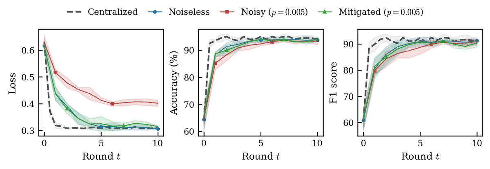
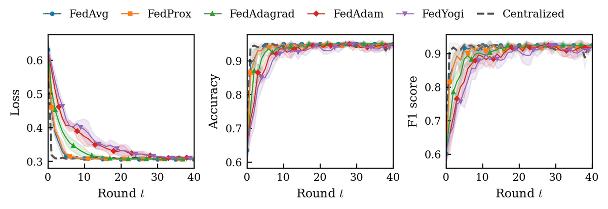
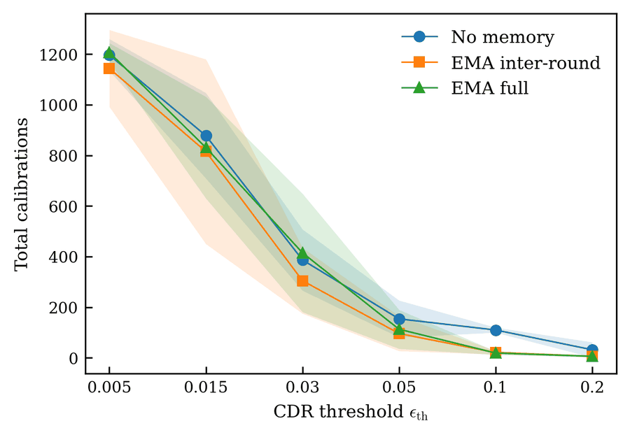

# Quantum Federated Learning with Qiboml and Flower

Federated learning on a variational quantum classifier, under simulated hardware
noise. Five clients train a 2-qubit circuit on their own data shards; the server
only ever sees weights. On top of that sits a noise model that drifts across
rounds, and Clifford Data Regression (CDR) mitigation with a memory of the
learned map, so that clients recalibrate only when the map has gone stale.

Code only — the run outputs and the thesis figures stay local.



*FedAvg under depolarizing + readout noise at p = 0.005, median over 7 seeds with
a MAD band. Mitigation closes the loss gap almost entirely, and leaves accuracy
where it already was.*

## What I found

**Adaptive server optimizers cost rounds and buy nothing here.** All five
strategies land on the same plateau — loss ≈ 0.307, accuracy ≈ 95%, both IID and
non-IID. What separates them is how fast they get there: FedAvg with a tuned
local learning rate drops below 0.35 in 4 rounds, FedAdam takes 13 and FedYogi
15. Under a Dirichlet split, where the adaptive methods are supposed to pay off,
the gap widens rather than closing (3 rounds against 17). On a task this small
the server-side moments spend their first rounds warming up, and there is
nothing left for them to fix afterwards.



**CDR recovers 88–92% of the loss lost to noise, and almost no accuracy.** At
p = 0.005 noise pushes the final loss from 0.307 to 0.402; mitigation brings it
back to 0.315, closing 92% of the gap, and the recovery holds as noise grows
(90% at p = 0.007, 88% at p = 0.014). Accuracy, meanwhile, moves from 93.3% to
94.0% — because what the noise degrades is the *calibration* of the predicted
probabilities, while the discrete decisions on this task are already saturated.
Reporting the recovery in accuracy points would have hidden the entire effect.

**Remembering the calibration map cuts its cost by up to four fifths, but only
in the federated regime.** The saving grows with the recalibration threshold:
negligible when the threshold is tight (4% at ε = 0.005), 21% at ε = 0.03, 38%
at ε = 0.05, and 81% at ε = 0.2. Up to ε = 0.05 it holds in every single seed
(paired sign test, p = 0.016). Run the same comparison on the centralized
pipeline and it vanishes — the memory pays off where recalibrations are many and
asynchronous across clients, not where one model recalibrates a handful of times.



## Start here

`notebooks/example.ipynb` walks through the mechanism on a tiny run — 2 clients,
5 rounds, a 2-qubit circuit — that finishes in under two minutes on a laptop: data,
circuit, federated loop, and a comparison between two strategies. It is not a
result; the numbers above come from server-side campaigns, 7 seeds and 40 rounds
each.

## Install

```bash
pip install -e .
```

Developed on Python 3.11 and 3.12. The dependencies are pinned in
`pyproject.toml`: `qibo` and `qiboml[torch]` for the circuit and its gradients,
`flwr[simulation]` and `flwr-datasets` for the federation, plus `scikit-learn`.
A CPU-only PyTorch is enough — the simulated circuits are 2 qubits wide.

## Experiments

```bash
python run_experiments/parallel_experiments.py --strategy FedAvg --workers 4
python run_experiments/centralized_experiments.py --mode mitigated --epochs 30
python run_experiments/parallel_tuning.py
```

Defaults for the Flower app live in `pyproject.toml`, under
`[tool.flwr.app.config]`. Noisy configurations are the expensive ones: the
simulator switches to density matrices and starts sampling, which costs about
100 seconds per round against 3 for the noiseless case.

## Figures and tables

Every figure goes through the same runner, launched from the repository root (or
from anywhere, if the package is installed); it resolves the data paths on its
own.

```bash
python -m thesis_plots --list            # available groups and figures
python -m thesis_plots all               # everything except the figures that use qibo
python -m thesis_plots noise             # a whole group
python -m thesis_plots noise.circle      # a single figure
python -m thesis_plots all --with-qibo   # including the ones that re-evaluate the model
```

The groups follow the chapters:

| group        | contents                                                        |
| ------------ | --------------------------------------------------------------- |
| `cap03`      | Dirichlet partitions, noise drift                               |
| `strategies` | strategy comparison, at 40 rounds and under noise               |
| `tuning`     | hyperparameter sweeps, IID and non-IID                          |
| `noise`      | effect of noise on FedAvg, seed isolation                       |
| `mitigation` | CDR: recovery, dependence on `p`, threshold, regression         |
| `memory`     | threshold sweep and memory of the CDR map                       |
| `tables`     | `.tex` (and `.csv`) table bodies                                |
| `extra`      | exploratory figures, outside the document                       |

Four entries are marked `[qibo]`: they re-evaluate the quantum model, so they
need the full run environment and take minutes rather than seconds.

## Layout

| folder             | contents                                                     |
| ------------------ | ------------------------------------------------------------ |
| `qibo_qfl_pt/`     | Flower app: client, server, custom strategy, model, noise    |
| `run_experiments/` | campaign launchers (federated, centralized, tuning)          |
| `thesis_plots/`    | figures and tables for the thesis                            |
| `notebooks/`       | `example.ipynb`, a toy run — start here                      |
| `figures/`         | the few figures shown in this README                         |
| `tools/`           | housekeeping utilities (run checks, result download)         |

## Development

The `.gitignore` works as a whitelist: it ignores everything at the repository
root and re-admits the code folders by hand. A new results directory is
therefore ignored by default, with nothing to add here — but so is a new *source*
directory, which needs its own `!/name/` line before git will see it. When a file
you expect is missing from `git status`, `git check-ignore -v <file>` names the
rule that is hiding it.

Inside `thesis_plots/` sit the pieces every figure shares: `style.py` (one
typography, drawn at the final inclusion size), `paths.py` (a single place for
data paths), `palette.py` (colours and markers), `loaders.py` (reading the run
JSONs) and `draw.py` (the recurring figure shapes). A change of form that should
apply to every figure is made once, there.

Code comments are in Italian.
